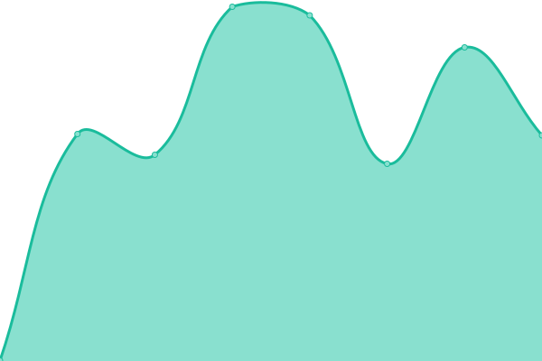
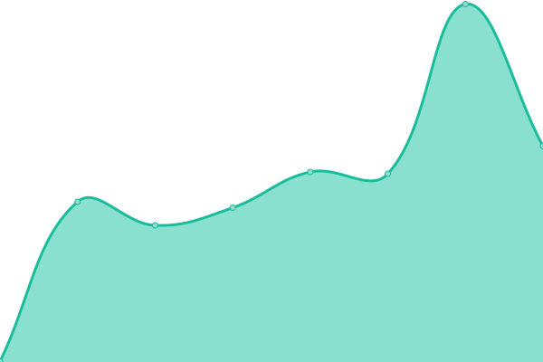

# [📈 Live Status](https://sixtoguerra1982.github.io/thunderlabs_monitor): <!--live status--> **🟧 Partial outage**

This repository contains the open-source uptime monitor and status page for [sixtoguerra1982](https://sixtoguerra1982.github.io/thunderlabs_monitor), powered by [Upptime](https://github.com/upptime/upptime).

With [Upptime](https://upptime.js.org), you can get your own unlimited and free uptime monitor and status page, powered entirely by a GitHub repository. We use [Issues](https://github.com/sixtoguerra1982/thunderlabs_monitor/issues) as incident reports, [Actions](https://github.com/sixtoguerra1982/thunderlabs_monitor/actions) as uptime monitors, and [Pages](https://sixtoguerra1982.github.io/thunderlabs_monitor) for the status page.

<!--start: status pages-->
<!-- This summary is generated by Upptime (https://github.com/upptime/upptime) -->
<!-- Do not edit this manually, your changes will be overwritten -->
<!-- prettier-ignore -->
| URL | Status | History | Response Time | Uptime |
| --- | ------ | ------- | ------------- | ------ |
|  [Intranet_Boliche](http://intranet.boliche.cl/) | 🟩 Up | [intranet-boliche.yml](https://github.com/sixtoguerra1982/thunderlabs_monitor/commits/HEAD/history/intranet-boliche.yml) | 

 517ms
     
 | 

<a href="https://sixtoguerra1982.github.io/thunderlabs_monitor/history/intranet-boliche">99.72%</a>
    

|  [Odin](https://odinback.thunderlabs.cl/) | 🟥 Down | [odin.yml](https://github.com/sixtoguerra1982/thunderlabs_monitor/commits/HEAD/history/odin.yml) | 

 0ms
     
 | 

<a href="https://sixtoguerra1982.github.io/thunderlabs_monitor/history/odin">0.00%</a>
    

<!--end: status pages-->

[**Visit our status website →**](https://sixtoguerra1982.github.io/thunderlabs_monitor)

## 📄 License

- Powered by: [Upptime](https://github.com/upptime/upptime)
- Code: [MIT](./LICENSE) © [sixtoguerra1982](https://sixtoguerra1982.github.io/thunderlabs_monitor)
- Data in the `./history` directory: [Open Database License](https://opendatacommons.org/licenses/odbl/1-0/)
